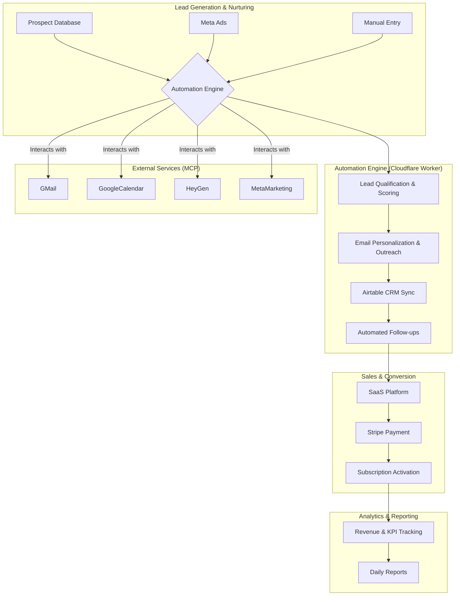

> Imported from Undone0603 sibling repo on 2026-09-20. **Legacy / non-live reference** — do not treat as current production architecture or pricing.

# AuthiChain Unified Autonomous Revenue System: Architecture

**Version:** 1.0
**Date:** February 19, 2026
**Author:** Manus AI

## 1. Introduction

This document outlines the architecture for a fully autonomous, unified revenue-generating system for AuthiChain. The system integrates three core components—the **AuthiChain AI Business Manager**, the **AuthiChain Premium SaaS Platform**, and the **QRON Anti-Counterfeit Platform**—into a single, cohesive engine. 

The primary goal is to create a self-sustaining system that automates the entire customer lifecycle, from lead generation and nurturing to sales conversion and revenue collection, leveraging a suite of modern tools and AI capabilities.

## 2. System Architecture Diagram

## 3. Core Components

### 3.1. Automation Engine (Cloudflare Worker)

The heart of the system is a Cloudflare Worker that orchestrates all automated tasks. This serverless function will be triggered by a cron job (e.g., every hour) and will be responsible for:

- **Lead Ingestion:** Pulling new prospects from the Airtable CRM and other sources.
- **Task Execution:** Running the lead qualification, email personalization, and outreach sequences.
- **Service Integration:** Interacting with all external services via MCP (Gmail, Google Calendar, etc.).
- **State Management:** Using Cloudflare KV to maintain state and prevent duplicate actions.

### 3.2. Airtable CRM

Airtable serves as the central nervous system for all data, acting as a comprehensive CRM and operational database. It will store and manage:

- **Accounts & Contacts:** All prospect and customer information.
- **Brands & Products:** Details on the brands and products being protected.
- **Deals & Invoices:** Tracking the sales pipeline and billing.
- **Campaigns & Events:** Logging all marketing and system activities.

### 3.3. AuthiChain Premium SaaS Platform

The Next.js application provides the user-facing interface for brands to manage their authenticated products. Key features include:

- **Dashboard:** For brands to view analytics and manage their subscriptions.
- **NFT Minting:** The interface for creating new authenticated products on the blockchain.
- **Marketplace:** A place for consumers to verify and trade authenticated goods.

### 3.4. AI & Personalization

AI is infused throughout the system to maximize efficiency and effectiveness:

- **Lead Scoring:** The `lead_qualification.py` script uses a weighted model to score leads based on firmographic and engagement data.
- **Email Personalization:** GPT-4.1 is used to generate highly personalized email copy for each prospect, referencing their specific industry, company, and pain points.
- **Social Engagement:** AI will be used to generate contextual and value-added comments for social media outreach.

## 4. Data Flow & Workflows

### 4.1. Lead Generation to Nurturing

1.  **Lead Capture:** New prospects are added to the "Accounts" and "Contacts" tables in Airtable. This can be done manually, via a web form, or through an integration with a lead generation tool.
2.  **Hourly Cron Trigger:** The Cloudflare Worker is triggered.
3.  **Lead Ingestion:** The worker queries the Airtable API for new leads.
4.  **Lead Qualification:** Each new lead is passed through the lead scoring model.
5.  **CRM Update:** The lead's score and status (Hot, Warm, Cold) are updated in Airtable.

### 4.2. Automated Outreach & Follow-up

1.  **Email Personalization:** For "Hot" and "Warm" leads, the system generates a personalized email using the templates and AI.
2.  **Email Sending:** The email is sent via the Gmail MCP.
3.  **Activity Logging:** The email and its content are logged in the "Events Log" table in Airtable.
4.  **Automated Follow-ups:** The system will use the Make.com webhook and Google Calendar integration to schedule and execute a sequence of follow-up emails and tasks based on lead engagement.

### 4.3. Sales Conversion & Revenue

1.  **SaaS Platform Engagement:** Leads are directed to the AuthiChain Premium Platform to sign up for a trial or paid plan.
2.  **Stripe Integration:** Stripe handles all subscription payments and billing.
3.  **Subscription Activation:** Upon successful payment, the user's account is activated, and their subscription status is updated in the `subscriptions` table in the Cloudflare D1 database.
4.  **Revenue Tracking:** All revenue data is synced to the "Revenue Metrics" and "Invoices" tables in Airtable for reporting.

## 5. Technology Stack

| Component | Technology |
| :--- | :--- |
| **Automation Engine** | Cloudflare Workers, TypeScript |
| **CRM & Database** | Airtable, Cloudflare D1, Supabase |
| **SaaS Platform** | Next.js, React, Tailwind CSS |
| **AI & Machine Learning** | OpenAI (GPT-4.1), Python |
| **Email & Calendar** | Gmail MCP, Google Calendar MCP |
| **Payments** | Stripe |
| **Blockchain** | Ethers.js, Solidity |

